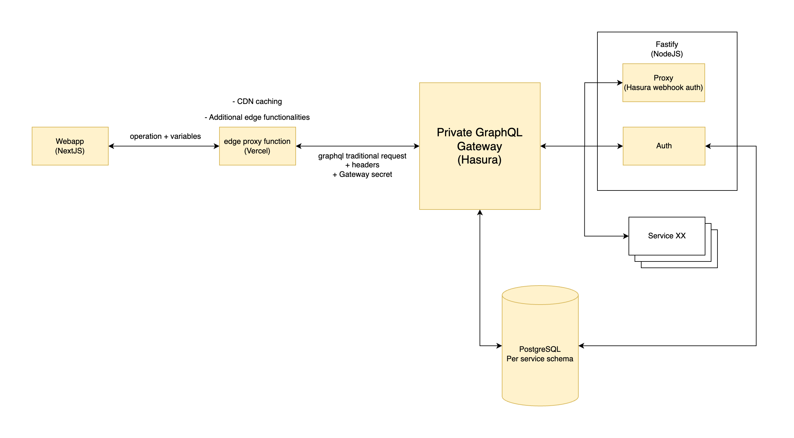

# Typescript, Hasura, Fastify, NextJS Starter

A high scalable and secure starter template based on Hasura, Fastify and NextJS.

Using best practices and typescript for best DX.

The goal is to create high scalable and flexible microservice system which is develop friendly as well.

## System Requirements

- NodeJS 16+
- PNPM
- Docker

## Architecture

Boxes in yellow are implemented

## TODO

- [ ] Documentation for development workflow
- [ ] Workspace service - a template for having workspaces
- [ ] Documentation for scalability
- [ ] Documentation for best practices
- [ ] CI with github actions
- [ ] CD with github actions
